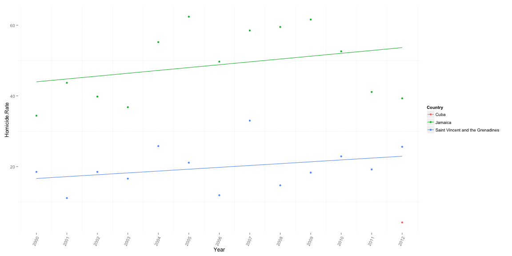
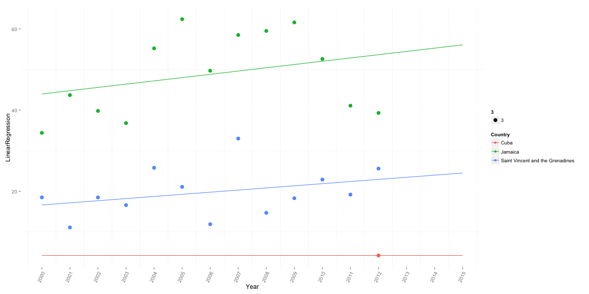

Homicide in the Caribbean
========================================================
width:  1800
height: 900

First Slide
========================================================

For more details on authoring R presentations click the
**Help** button on the toolbar.

- Bullet 1
- Bullet 2
- Bullet 3

Load Raw Data
========================================================


```r
library(knitr)
data <- read.csv('data/crime_data.csv', stringsAsFactors=F)
kable(data %>% sample_n(8), caption='Raw Data Set', format='html') 
```

<table>
<caption>Raw Data Set</caption>
 <thead>
  <tr>
   <th style="text-align:left;">   </th>
   <th style="text-align:left;"> Country </th>
   <th style="text-align:right;"> X2000 </th>
   <th style="text-align:right;"> X2001 </th>
   <th style="text-align:right;"> X2002 </th>
   <th style="text-align:right;"> X2003 </th>
   <th style="text-align:right;"> X2004 </th>
   <th style="text-align:right;"> X2005 </th>
   <th style="text-align:right;"> X2006 </th>
   <th style="text-align:right;"> X2007 </th>
   <th style="text-align:right;"> X2008 </th>
   <th style="text-align:right;"> X2009 </th>
   <th style="text-align:right;"> X2010 </th>
   <th style="text-align:right;"> X2011 </th>
   <th style="text-align:right;"> X2012 </th>
  </tr>
 </thead>
<tbody>
  <tr>
   <td style="text-align:left;"> 21 </td>
   <td style="text-align:left;"> Trinidad and Tobago </td>
   <td style="text-align:right;"> 9.5 </td>
   <td style="text-align:right;"> 11.9 </td>
   <td style="text-align:right;"> 13.4 </td>
   <td style="text-align:right;"> 17.8 </td>
   <td style="text-align:right;"> 20.1 </td>
   <td style="text-align:right;"> 29.8 </td>
   <td style="text-align:right;"> 28.5 </td>
   <td style="text-align:right;"> 29.8 </td>
   <td style="text-align:right;"> 41.6 </td>
   <td style="text-align:right;"> 38.3 </td>
   <td style="text-align:right;"> 35.6 </td>
   <td style="text-align:right;"> 26.4 </td>
   <td style="text-align:right;"> 28.3 </td>
  </tr>
  <tr>
   <td style="text-align:left;"> 6 </td>
   <td style="text-align:left;"> British Virgin Islands </td>
   <td style="text-align:right;"> 0.0 </td>
   <td style="text-align:right;"> 4.7 </td>
   <td style="text-align:right;"> 4.6 </td>
   <td style="text-align:right;"> 9.0 </td>
   <td style="text-align:right;"> 17.8 </td>
   <td style="text-align:right;"> NA </td>
   <td style="text-align:right;"> 8.4 </td>
   <td style="text-align:right;"> NA </td>
   <td style="text-align:right;"> NA </td>
   <td style="text-align:right;"> NA </td>
   <td style="text-align:right;"> NA </td>
   <td style="text-align:right;"> NA </td>
   <td style="text-align:right;"> NA </td>
  </tr>
  <tr>
   <td style="text-align:left;"> 4 </td>
   <td style="text-align:left;"> Bahamas </td>
   <td style="text-align:right;"> 24.9 </td>
   <td style="text-align:right;"> 14.2 </td>
   <td style="text-align:right;"> 16.8 </td>
   <td style="text-align:right;"> 15.8 </td>
   <td style="text-align:right;"> 13.6 </td>
   <td style="text-align:right;"> 15.8 </td>
   <td style="text-align:right;"> 18.2 </td>
   <td style="text-align:right;"> 22.8 </td>
   <td style="text-align:right;"> 21.0 </td>
   <td style="text-align:right;"> 24.5 </td>
   <td style="text-align:right;"> 26.1 </td>
   <td style="text-align:right;"> 34.7 </td>
   <td style="text-align:right;"> 29.8 </td>
  </tr>
  <tr>
   <td style="text-align:left;"> 22 </td>
   <td style="text-align:left;"> Turks and Caicos Islands </td>
   <td style="text-align:right;"> 0.0 </td>
   <td style="text-align:right;"> 0.0 </td>
   <td style="text-align:right;"> 11.3 </td>
   <td style="text-align:right;"> 0.0 </td>
   <td style="text-align:right;"> 0.0 </td>
   <td style="text-align:right;"> 0.0 </td>
   <td style="text-align:right;"> NA </td>
   <td style="text-align:right;"> NA </td>
   <td style="text-align:right;"> 6.8 </td>
   <td style="text-align:right;"> 6.6 </td>
   <td style="text-align:right;"> NA </td>
   <td style="text-align:right;"> NA </td>
   <td style="text-align:right;"> NA </td>
  </tr>
  <tr>
   <td style="text-align:left;"> 9 </td>
   <td style="text-align:left;"> Dominica </td>
   <td style="text-align:right;"> 2.9 </td>
   <td style="text-align:right;"> 1.4 </td>
   <td style="text-align:right;"> 12.9 </td>
   <td style="text-align:right;"> 11.4 </td>
   <td style="text-align:right;"> 11.4 </td>
   <td style="text-align:right;"> 11.3 </td>
   <td style="text-align:right;"> 7.1 </td>
   <td style="text-align:right;"> 9.9 </td>
   <td style="text-align:right;"> 9.9 </td>
   <td style="text-align:right;"> 18.3 </td>
   <td style="text-align:right;"> 21.1 </td>
   <td style="text-align:right;"> NA </td>
   <td style="text-align:right;"> NA </td>
  </tr>
  <tr>
   <td style="text-align:left;"> 12 </td>
   <td style="text-align:left;"> Guadeloupe </td>
   <td style="text-align:right;"> NA </td>
   <td style="text-align:right;"> NA </td>
   <td style="text-align:right;"> NA </td>
   <td style="text-align:right;"> NA </td>
   <td style="text-align:right;"> 5.9 </td>
   <td style="text-align:right;"> 5.2 </td>
   <td style="text-align:right;"> 5.4 </td>
   <td style="text-align:right;"> 6.4 </td>
   <td style="text-align:right;"> 7.1 </td>
   <td style="text-align:right;"> 7.9 </td>
   <td style="text-align:right;"> NA </td>
   <td style="text-align:right;"> NA </td>
   <td style="text-align:right;"> NA </td>
  </tr>
  <tr>
   <td style="text-align:left;"> 19 </td>
   <td style="text-align:left;"> Saint Lucia </td>
   <td style="text-align:right;"> 14.7 </td>
   <td style="text-align:right;"> 21.4 </td>
   <td style="text-align:right;"> 26.2 </td>
   <td style="text-align:right;"> 22.3 </td>
   <td style="text-align:right;"> 22.6 </td>
   <td style="text-align:right;"> 24.8 </td>
   <td style="text-align:right;"> 25.6 </td>
   <td style="text-align:right;"> 17.0 </td>
   <td style="text-align:right;"> 22.6 </td>
   <td style="text-align:right;"> 22.3 </td>
   <td style="text-align:right;"> 24.8 </td>
   <td style="text-align:right;"> NA </td>
   <td style="text-align:right;"> 21.6 </td>
  </tr>
  <tr>
   <td style="text-align:left;"> 16 </td>
   <td style="text-align:left;"> Montserrat </td>
   <td style="text-align:right;"> 0.0 </td>
   <td style="text-align:right;"> 0.0 </td>
   <td style="text-align:right;"> 0.0 </td>
   <td style="text-align:right;"> 0.0 </td>
   <td style="text-align:right;"> 0.0 </td>
   <td style="text-align:right;"> 20.9 </td>
   <td style="text-align:right;"> 20.6 </td>
   <td style="text-align:right;"> NA </td>
   <td style="text-align:right;"> 20.4 </td>
   <td style="text-align:right;"> NA </td>
   <td style="text-align:right;"> NA </td>
   <td style="text-align:right;"> NA </td>
   <td style="text-align:right;"> NA </td>
  </tr>
</tbody>
</table>

Transform Raw Data
========================================================


```r
data <- data %>% 
  
  # Turn columns into rows, repeating the country each time
  melt(id.vars='Country', variable.name = 'Year', value.name = 'Homicide.Rate') %>% 
  
  # Convert the years to numeric values and subtract the minimum year from each
  mutate(Year = as.numeric(str_replace(Year, 'X', '')) - 2000) %>%
  
  # Remove absent values for the sake of later modeling
  filter(!is.na(Homicide.Rate))

kable(data %>% sample_n(8), caption='Transformed Data Set', format='html')
```

<table>
<caption>Transformed Data Set</caption>
 <thead>
  <tr>
   <th style="text-align:left;">   </th>
   <th style="text-align:left;"> Country </th>
   <th style="text-align:right;"> Year </th>
   <th style="text-align:right;"> Homicide.Rate </th>
  </tr>
 </thead>
<tbody>
  <tr>
   <td style="text-align:left;"> 71 </td>
   <td style="text-align:left;"> Saint Vincent and the Grenadines </td>
   <td style="text-align:right;"> 3 </td>
   <td style="text-align:right;"> 16.6 </td>
  </tr>
  <tr>
   <td style="text-align:left;"> 229 </td>
   <td style="text-align:left;"> Saint Vincent and the Grenadines </td>
   <td style="text-align:right;"> 12 </td>
   <td style="text-align:right;"> 25.6 </td>
  </tr>
  <tr>
   <td style="text-align:left;"> 140 </td>
   <td style="text-align:left;"> Cayman Islands </td>
   <td style="text-align:right;"> 7 </td>
   <td style="text-align:right;"> 3.9 </td>
  </tr>
  <tr>
   <td style="text-align:left;"> 34 </td>
   <td style="text-align:left;"> Trinidad and Tobago </td>
   <td style="text-align:right;"> 1 </td>
   <td style="text-align:right;"> 11.9 </td>
  </tr>
  <tr>
   <td style="text-align:left;"> 154 </td>
   <td style="text-align:left;"> Anguilla </td>
   <td style="text-align:right;"> 8 </td>
   <td style="text-align:right;"> 7.5 </td>
  </tr>
  <tr>
   <td style="text-align:left;"> 206 </td>
   <td style="text-align:left;"> Saint Vincent and the Grenadines </td>
   <td style="text-align:right;"> 10 </td>
   <td style="text-align:right;"> 22.9 </td>
  </tr>
  <tr>
   <td style="text-align:left;"> 227 </td>
   <td style="text-align:left;"> Saint Kitts and Nevis </td>
   <td style="text-align:right;"> 12 </td>
   <td style="text-align:right;"> 33.6 </td>
  </tr>
  <tr>
   <td style="text-align:left;"> 99 </td>
   <td style="text-align:left;"> Bahamas </td>
   <td style="text-align:right;"> 5 </td>
   <td style="text-align:right;"> 15.8 </td>
  </tr>
</tbody>
</table>

Maximum Likelihood Regression (Theory)
========================================================

We want to know the following for each country: 

Maximum Likelihood Regression (Application)
======================================================== 


```r
library(lme4)

# Regress the homicide rate by year, but allow for slopes and intercepts
# to vary by country.  The "0" here means that there are no intercepts
# or slopes common to all countries. 
fit <- lmer(Homicide.Rate ~ 0 + (Year|Country), data = data)

# Randomly simulate predictions from the fitted model to get a sense
# of variance for each country
predictions <- foreach(c=unique(data$Country), .combine=rbind) %do%{ 
  pred.d <- data.frame(Country=c, Year=(2014:2015) - 2000)
  pred.fun <- function(x) { predict(x, pred.d, type='response') }
  bootfit <- bootMer(fit, use.u=T, nsim=5, FUN=pred.fun)
  # Column "2" below is the prediction for 2015
  data.frame(Country=c, Prediction=bootfit$t[,2])
}
```


Maximum Likelihood Regression (Predictions)
======================================================== 


```r
ordered.countries <- predictions %>% group_by(Country) %>% 
  summarise(Median=median(Prediction)) %>%
  arrange(desc(Median)) %>% .$Country

predictions %>% 
  mutate(Country=factor(as.character(Country), levels=ordered.countries)) %>%
  ggplot(aes(x=Country, y=Prediction)) + geom_boxplot() + ylab('Homicide.Rate') +  
  theme_boxplot + ggtitle('2015 Homicide Rate Predictions')
```



Cuba
======================================================== 

If the ONLY known Homicide Rate for Cuba is 4.2 (recorded in 2012),

Why then, do the predictions for Homicide Rates in other years look like this?



Probabilistic (i.e. Bayesian) Modeling
======================================================== 

Going back to the original problem, we're going to start with a dataset like this:


```r
kable(data %>% sample_n(8), caption='Raw Data Set', format='html') 
```

<table>
<caption>Raw Data Set</caption>
 <thead>
  <tr>
   <th style="text-align:left;">   </th>
   <th style="text-align:left;"> Country </th>
   <th style="text-align:right;"> Year </th>
   <th style="text-align:right;"> Homicide.Rate </th>
  </tr>
 </thead>
<tbody>
  <tr>
   <td style="text-align:left;"> 65 </td>
   <td style="text-align:left;"> Grenada </td>
   <td style="text-align:right;"> 3 </td>
   <td style="text-align:right;"> 8.8 </td>
  </tr>
  <tr>
   <td style="text-align:left;"> 153 </td>
   <td style="text-align:left;"> United States Virgin Islands </td>
   <td style="text-align:right;"> 7 </td>
   <td style="text-align:right;"> 40.1 </td>
  </tr>
  <tr>
   <td style="text-align:left;"> 37 </td>
   <td style="text-align:left;"> Anguilla </td>
   <td style="text-align:right;"> 2 </td>
   <td style="text-align:right;"> 17.1 </td>
  </tr>
  <tr>
   <td style="text-align:left;"> 58 </td>
   <td style="text-align:left;"> Aruba </td>
   <td style="text-align:right;"> 3 </td>
   <td style="text-align:right;"> 4.1 </td>
  </tr>
  <tr>
   <td style="text-align:left;"> 196 </td>
   <td style="text-align:left;"> Bahamas </td>
   <td style="text-align:right;"> 10 </td>
   <td style="text-align:right;"> 26.1 </td>
  </tr>
  <tr>
   <td style="text-align:left;"> 101 </td>
   <td style="text-align:left;"> Dominica </td>
   <td style="text-align:right;"> 5 </td>
   <td style="text-align:right;"> 11.3 </td>
  </tr>
  <tr>
   <td style="text-align:left;"> 201 </td>
   <td style="text-align:left;"> Haiti  </td>
   <td style="text-align:right;"> 10 </td>
   <td style="text-align:right;"> 6.8 </td>
  </tr>
  <tr>
   <td style="text-align:left;"> 125 </td>
   <td style="text-align:left;"> Guadeloupe </td>
   <td style="text-align:right;"> 6 </td>
   <td style="text-align:right;"> 5.4 </td>
  </tr>
</tbody>
</table>

Probabilistic Modeling
======================================================== 

What does a "probabilistic model" look like?


Slide With Plot
========================================================

 
