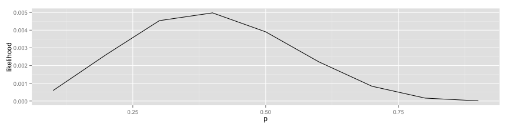
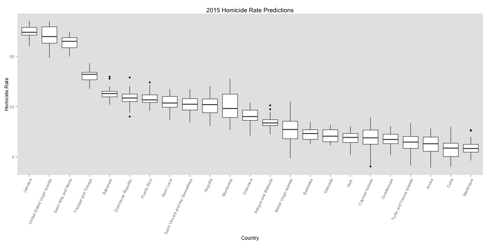
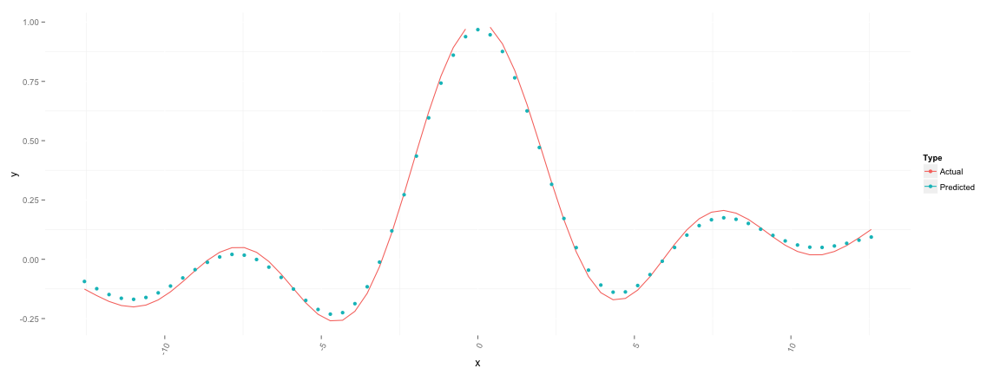

Caribbean Crime
========================================================
width:  1800
height: 1200

R Presentations
========================================================

For more details on authoring R presentations click the
**Help** button on the toolbar.

- Bullet 1
- Bullet 2
- Bullet 3


```r
# some code
data.frame(some_number=1:3, some_letter=c('a', 'b', 'c')) 
```

```
  some_number some_letter
1           1           a
2           2           b
3           3           c
```

Raw Crime Data
========================================================


```r
library(knitr)
data <- read.csv('data/crime_data.csv', stringsAsFactors=F)
kable(data %>% sample_n(8), caption='Raw Data Set', format='html') 
```

<table>
<caption>Raw Data Set</caption>
 <thead>
  <tr>
   <th style="text-align:left;">   </th>
   <th style="text-align:left;"> Country </th>
   <th style="text-align:right;"> X2000 </th>
   <th style="text-align:right;"> X2001 </th>
   <th style="text-align:right;"> X2002 </th>
   <th style="text-align:right;"> X2003 </th>
   <th style="text-align:right;"> X2004 </th>
   <th style="text-align:right;"> X2005 </th>
   <th style="text-align:right;"> X2006 </th>
   <th style="text-align:right;"> X2007 </th>
   <th style="text-align:right;"> X2008 </th>
   <th style="text-align:right;"> X2009 </th>
   <th style="text-align:right;"> X2010 </th>
   <th style="text-align:right;"> X2011 </th>
   <th style="text-align:right;"> X2012 </th>
  </tr>
 </thead>
<tbody>
  <tr>
   <td style="text-align:left;"> 5 </td>
   <td style="text-align:left;"> Barbados </td>
   <td style="text-align:right;"> 7.5 </td>
   <td style="text-align:right;"> 9.3 </td>
   <td style="text-align:right;"> 9.3 </td>
   <td style="text-align:right;"> 12.2 </td>
   <td style="text-align:right;"> 8.1 </td>
   <td style="text-align:right;"> 10.6 </td>
   <td style="text-align:right;"> 12.7 </td>
   <td style="text-align:right;"> 9.8 </td>
   <td style="text-align:right;"> 9.0 </td>
   <td style="text-align:right;"> 6.8 </td>
   <td style="text-align:right;"> 11.1 </td>
   <td style="text-align:right;"> 9.6 </td>
   <td style="text-align:right;"> 7.4 </td>
  </tr>
  <tr>
   <td style="text-align:left;"> 6 </td>
   <td style="text-align:left;"> British Virgin Islands </td>
   <td style="text-align:right;"> 0.0 </td>
   <td style="text-align:right;"> 4.7 </td>
   <td style="text-align:right;"> 4.6 </td>
   <td style="text-align:right;"> 9.0 </td>
   <td style="text-align:right;"> 17.8 </td>
   <td style="text-align:right;"> NA </td>
   <td style="text-align:right;"> 8.4 </td>
   <td style="text-align:right;"> NA </td>
   <td style="text-align:right;"> NA </td>
   <td style="text-align:right;"> NA </td>
   <td style="text-align:right;"> NA </td>
   <td style="text-align:right;"> NA </td>
   <td style="text-align:right;"> NA </td>
  </tr>
  <tr>
   <td style="text-align:left;"> 11 </td>
   <td style="text-align:left;"> Grenada </td>
   <td style="text-align:right;"> 14.8 </td>
   <td style="text-align:right;"> 5.9 </td>
   <td style="text-align:right;"> 13.7 </td>
   <td style="text-align:right;"> 8.8 </td>
   <td style="text-align:right;"> 5.8 </td>
   <td style="text-align:right;"> 10.7 </td>
   <td style="text-align:right;"> 11.6 </td>
   <td style="text-align:right;"> 10.6 </td>
   <td style="text-align:right;"> 15.4 </td>
   <td style="text-align:right;"> 6.7 </td>
   <td style="text-align:right;"> 9.6 </td>
   <td style="text-align:right;"> 3.8 </td>
   <td style="text-align:right;"> 13.3 </td>
  </tr>
  <tr>
   <td style="text-align:left;"> 22 </td>
   <td style="text-align:left;"> Turks and Caicos Islands </td>
   <td style="text-align:right;"> 0.0 </td>
   <td style="text-align:right;"> 0.0 </td>
   <td style="text-align:right;"> 11.3 </td>
   <td style="text-align:right;"> 0.0 </td>
   <td style="text-align:right;"> 0.0 </td>
   <td style="text-align:right;"> 0.0 </td>
   <td style="text-align:right;"> NA </td>
   <td style="text-align:right;"> NA </td>
   <td style="text-align:right;"> 6.8 </td>
   <td style="text-align:right;"> 6.6 </td>
   <td style="text-align:right;"> NA </td>
   <td style="text-align:right;"> NA </td>
   <td style="text-align:right;"> NA </td>
  </tr>
  <tr>
   <td style="text-align:left;"> 18 </td>
   <td style="text-align:left;"> Saint Kitts and Nevis </td>
   <td style="text-align:right;"> 6.6 </td>
   <td style="text-align:right;"> 13.0 </td>
   <td style="text-align:right;"> 10.7 </td>
   <td style="text-align:right;"> 21.0 </td>
   <td style="text-align:right;"> 22.7 </td>
   <td style="text-align:right;"> 16.3 </td>
   <td style="text-align:right;"> 34.1 </td>
   <td style="text-align:right;"> 31.7 </td>
   <td style="text-align:right;"> 45.0 </td>
   <td style="text-align:right;"> 52.2 </td>
   <td style="text-align:right;"> 40.1 </td>
   <td style="text-align:right;"> 64.2 </td>
   <td style="text-align:right;"> 33.6 </td>
  </tr>
  <tr>
   <td style="text-align:left;"> 21 </td>
   <td style="text-align:left;"> Trinidad and Tobago </td>
   <td style="text-align:right;"> 9.5 </td>
   <td style="text-align:right;"> 11.9 </td>
   <td style="text-align:right;"> 13.4 </td>
   <td style="text-align:right;"> 17.8 </td>
   <td style="text-align:right;"> 20.1 </td>
   <td style="text-align:right;"> 29.8 </td>
   <td style="text-align:right;"> 28.5 </td>
   <td style="text-align:right;"> 29.8 </td>
   <td style="text-align:right;"> 41.6 </td>
   <td style="text-align:right;"> 38.3 </td>
   <td style="text-align:right;"> 35.6 </td>
   <td style="text-align:right;"> 26.4 </td>
   <td style="text-align:right;"> 28.3 </td>
  </tr>
  <tr>
   <td style="text-align:left;"> 7 </td>
   <td style="text-align:left;"> Cayman Islands </td>
   <td style="text-align:right;"> 9.6 </td>
   <td style="text-align:right;"> 4.9 </td>
   <td style="text-align:right;"> 0.0 </td>
   <td style="text-align:right;"> 7.4 </td>
   <td style="text-align:right;"> 12.3 </td>
   <td style="text-align:right;"> NA </td>
   <td style="text-align:right;"> 2.0 </td>
   <td style="text-align:right;"> 3.9 </td>
   <td style="text-align:right;"> 7.6 </td>
   <td style="text-align:right;"> 14.7 </td>
   <td style="text-align:right;"> NA </td>
   <td style="text-align:right;"> NA </td>
   <td style="text-align:right;"> NA </td>
  </tr>
  <tr>
   <td style="text-align:left;"> 3 </td>
   <td style="text-align:left;"> Aruba </td>
   <td style="text-align:right;"> NA </td>
   <td style="text-align:right;"> NA </td>
   <td style="text-align:right;"> 5.3 </td>
   <td style="text-align:right;"> 4.1 </td>
   <td style="text-align:right;"> 2.0 </td>
   <td style="text-align:right;"> 12.0 </td>
   <td style="text-align:right;"> 9.9 </td>
   <td style="text-align:right;"> 5.9 </td>
   <td style="text-align:right;"> 4.9 </td>
   <td style="text-align:right;"> 3.9 </td>
   <td style="text-align:right;"> 3.9 </td>
   <td style="text-align:right;"> NA </td>
   <td style="text-align:right;"> NA </td>
  </tr>
</tbody>
</table>

Transform Raw Data
========================================================


```r
data <- data %>% 
  
  # Turn columns into rows, repeating the country each time
  melt(id.vars='Country', variable.name='Year', value.name='Homicide.Rate') %>% 
  
  # Convert the years to numeric values and subtract the minimum year from each; also
  # convert names of countries to factors
  mutate(Year=as.numeric(str_replace(Year, 'X', '')) - 2000, Country=factor(Country)) %>%
  
  # Remove absent values for the sake of later modeling
  filter(!is.na(Homicide.Rate))

data %>% sample_n(8) # Transformed Data Set
```

```
                     Country Year Homicide.Rate
49               Puerto Rico    2          20.6
213                   Haiti    11           9.1
35  Turks and Caicos Islands    1           0.0
80    British Virgin Islands    4          17.8
30               Puerto Rico    1          19.7
139                 Barbados    7           9.8
148              Puerto Rico    7          19.6
199       Dominican Republic   10          24.7
```


The Goal: Predict 2015 Homicide Rate
======================================================== 


```r
get.linear.regressions()  
```


Shared Slopes
======================================================== 

- The slopes and intercepts amongst the islands are likely related
- There are enough countries with little data that separate regressions would suck


Hiearchical Modeling
======================================================== 

- Usual linear regression:

$$ HomicideRate_i = \beta_{0} + Year_i \cdot \beta_1 + \epsilon$$
    
$$ \epsilon \sim \mathcal{N}(0, \sigma) $$
    
- Hierarchical regression
  - Each country has it's own slope and intercept, both of which are sort of shared

$$ i \in Years, j \in Countries: $$

$$HomicideRate_{ij} = \beta_{0j} + Year_{ij} \cdot \beta_{1j} + \epsilon$$

$$\beta_{0j} \sim \mathcal{N}(\mu_0, \sigma_0)$$
$$\beta_{1j} \sim \mathcal{N}(\mu_1, \sigma_1)$$ 
$$\epsilon \sim \mathcal{N}(0, \sigma)$$


Probabilistic (i.e. Bayesian) Modeling
======================================================== 

What does a "probabilistic model" look like?

Here's one [example](https://github.com/eric-czech/portfolio/blob/master/demonstrative/R/meetups/data_analysis_examples/bayes_regression.stan)

Running A Probabilistic Model
======================================================== 


```r
setwd('/Users/eczech/repos/portfolio/demonstrative/R/meetups/data_analysis_examples')

countries <- unique(data$Country)
stan.data <- list(
  N = nrow(data),
  C = length(unique(data$Country)),
  country = match(data$Country, countries),
  year = data$Year,
  homicide = data$Homicide.Rate
)

fit <- stan('bayes_regression.stan', data = stan.data , warmup = 2000, iter = 5000, thin = 100, chains = 4, verbose = FALSE)
```

```

TRANSLATING MODEL 'bayes_regression' FROM Stan CODE TO C++ CODE NOW.
COMPILING THE C++ CODE FOR MODEL 'bayes_regression' NOW.
In file included from file16abc1dfe095b.cpp:8:
In file included from /Users/eczech/Library/R/3.1/library/rstan/include//stansrc/stan/model/model_header.hpp:17:
In file included from /Users/eczech/Library/R/3.1/library/rstan/include//stansrc/stan/agrad/rev.hpp:5:
/Users/eczech/Library/R/3.1/library/rstan/include//stansrc/stan/agrad/rev/chainable.hpp:87:17: warning: 'static' function 'set_zero_all_adjoints' declared in header file should be declared 'static inline' [-Wunneeded-internal-declaration]
    static void set_zero_all_adjoints() {
                ^
In file included from file16abc1dfe095b.cpp:8:
In file included from /Users/eczech/Library/R/3.1/library/rstan/include//stansrc/stan/model/model_header.hpp:21:
/Users/eczech/Library/R/3.1/library/rstan/include//stansrc/stan/io/dump.hpp:26:14: warning: function 'product' is not needed and will not be emitted [-Wunneeded-internal-declaration]
      size_t product(std::vector<size_t> dims) {
             ^
2 warnings generated.

SAMPLING FOR MODEL 'bayes_regression' NOW (CHAIN 1).

Iteration:    1 / 5000 [  0%]  (Warmup)
Iteration:  500 / 5000 [ 10%]  (Warmup)
Iteration: 1000 / 5000 [ 20%]  (Warmup)
Iteration: 1500 / 5000 [ 30%]  (Warmup)
Iteration: 2000 / 5000 [ 40%]  (Warmup)
Iteration: 2001 / 5000 [ 40%]  (Sampling)
Iteration: 2500 / 5000 [ 50%]  (Sampling)
Iteration: 3000 / 5000 [ 60%]  (Sampling)
Iteration: 3500 / 5000 [ 70%]  (Sampling)
Iteration: 4000 / 5000 [ 80%]  (Sampling)
Iteration: 4500 / 5000 [ 90%]  (Sampling)
Iteration: 5000 / 5000 [100%]  (Sampling)
#  Elapsed Time: 1.34428 seconds (Warm-up)
#                1.84794 seconds (Sampling)
#                3.19222 seconds (Total)


SAMPLING FOR MODEL 'bayes_regression' NOW (CHAIN 2).

Iteration:    1 / 5000 [  0%]  (Warmup)
Iteration:  500 / 5000 [ 10%]  (Warmup)
Iteration: 1000 / 5000 [ 20%]  (Warmup)
Iteration: 1500 / 5000 [ 30%]  (Warmup)
Iteration: 2000 / 5000 [ 40%]  (Warmup)
Iteration: 2001 / 5000 [ 40%]  (Sampling)
Iteration: 2500 / 5000 [ 50%]  (Sampling)
Iteration: 3000 / 5000 [ 60%]  (Sampling)
Iteration: 3500 / 5000 [ 70%]  (Sampling)
Iteration: 4000 / 5000 [ 80%]  (Sampling)
Iteration: 4500 / 5000 [ 90%]  (Sampling)
Iteration: 5000 / 5000 [100%]  (Sampling)
#  Elapsed Time: 1.47473 seconds (Warm-up)
#                1.47103 seconds (Sampling)
#                2.94576 seconds (Total)


SAMPLING FOR MODEL 'bayes_regression' NOW (CHAIN 3).

Iteration:    1 / 5000 [  0%]  (Warmup)
Iteration:  500 / 5000 [ 10%]  (Warmup)
Iteration: 1000 / 5000 [ 20%]  (Warmup)
Iteration: 1500 / 5000 [ 30%]  (Warmup)
Iteration: 2000 / 5000 [ 40%]  (Warmup)
Iteration: 2001 / 5000 [ 40%]  (Sampling)
Iteration: 2500 / 5000 [ 50%]  (Sampling)
Iteration: 3000 / 5000 [ 60%]  (Sampling)
Iteration: 3500 / 5000 [ 70%]  (Sampling)
Iteration: 4000 / 5000 [ 80%]  (Sampling)
Iteration: 4500 / 5000 [ 90%]  (Sampling)
Iteration: 5000 / 5000 [100%]  (Sampling)
#  Elapsed Time: 1.39491 seconds (Warm-up)
#                1.81535 seconds (Sampling)
#                3.21027 seconds (Total)


SAMPLING FOR MODEL 'bayes_regression' NOW (CHAIN 4).

Iteration:    1 / 5000 [  0%]  (Warmup)
Iteration:  500 / 5000 [ 10%]  (Warmup)
Iteration: 1000 / 5000 [ 20%]  (Warmup)
Iteration: 1500 / 5000 [ 30%]  (Warmup)
Iteration: 2000 / 5000 [ 40%]  (Warmup)
Iteration: 2001 / 5000 [ 40%]  (Sampling)
Iteration: 2500 / 5000 [ 50%]  (Sampling)
Iteration: 3000 / 5000 [ 60%]  (Sampling)
Iteration: 3500 / 5000 [ 70%]  (Sampling)
Iteration: 4000 / 5000 [ 80%]  (Sampling)
Iteration: 4500 / 5000 [ 90%]  (Sampling)
Iteration: 5000 / 5000 [100%]  (Sampling)
#  Elapsed Time: 1.43747 seconds (Warm-up)
#                1.55635 seconds (Sampling)
#                2.99382 seconds (Total)
```

```r
bayes.predictions <- rstan::extract(fit)$predictions
```


Probabilistic Model Predictions
======================================================== 


```r
bayes.predictions %>% sample_n(5)    
```

```
     SampleId     Country Prediction
758        38    Dominica 22.1622335
2463       63  Martinique -0.2730133
1668      108 Saint Lucia 21.0062195
1375       55 Puerto Rico 22.4594264
2478       78  Martinique -4.8188667
```

```r
plot.predictions(bayes.predictions, 'Probability Model Predictions') 
```


Cuba
======================================================== 

If the ONLY known Homicide Rate for Cuba is 4.2 (recorded in 2012),

Why then, do the 2015 predictions look like this?


Maximum Likelihood (Theory)
========================================================

What is the true probability that I forget my lunch for work?


| Day|Result |
|---:|:------|
|   1|Yes    |
|   2|No     |
|   3|No     |
|   4|No     |
|   5|Yes    |
|   6|No     |
|   7|No     |
|   8|Yes    |

Pr(forget lunch) = # Yes's / # Total = 3/8 = .375

Obviously

Maximum Likelihood (Theory 2)
========================================================

What if it wasn't obvious?  What if you just had to guess and test some how?

Given some guess $p$, we can say that the probability or likelihood of seeing our data was:

$$Pr(\text{data we saw }|p) = Pr(3 \text{Yes's }|p) \cdot Pr(5 \text{No's }|p) $$

$$ = p^3 \cdot (1-p)^5%$$

<br>
So if we randomly guess that $p$ is .1, then the "likelihood" of our data is $.1^3 \cdot .9^5 = 0.0006$

Other random guesses: 


```r
p=seq(.1, .9, .1)
data.frame(p=p, likelihood=p^3 * (1-p)^5)
```

```
    p likelihood
1 0.1 0.00059049
2 0.2 0.00262144
3 0.3 0.00453789
4 0.4 0.00497664
5 0.5 0.00390625
6 0.6 0.00221184
7 0.7 0.00083349
8 0.8 0.00016384
9 0.9 0.00000729
```

Maximum Likelihood (Theory 2)
========================================================

<br>
<center>What $p$ makes the likelihood highest?</center>



Sometimes you can cheat by taking the derivative with respect to $p$ and setting that to 0

This gives $p=\frac{3}{8} = .375$ in this case


Going back to the original problem, we're going to start with a dataset like this:

```r
# Raw Data Set Sample
data %>% sample_n(8)
```

```
                  Country Year Homicide.Rate
20    Antigua and Barbuda    1           8.9
141              Dominica    7           9.9
4                Barbados    0           7.5
50  Saint Kitts and Nevis    2          10.7
56               Anguilla    3          16.6
70            Saint Lucia    3          22.3
225               Jamaica   12          39.3
157               Bahamas    8          21.0
```

Maximum Likelihood Regression (Application 2)
======================================================== 


What is the likelihood for this guess at a regression line?


```r
get.points()  
```


Maximum Likelihood Regression (in R)
======================================================== 


```r
library(lme4)
library(foreach)

# Regress the homicide rate by year, but allow for slopes and intercepts
# to vary by country.  The "0" here means that there are no intercepts
# or slopes common to all countries. 
fit <- lmer(Homicide.Rate ~ 0 + (Year|Country), data = data)

# Randomly simulate predictions from the fitted model to get a sense
# of variance for each country
ml.predictions <- foreach(c=unique(data$Country), .combine=rbind) %do%{ 
  predictions <- data.frame(Country=c, Year=(2014:2015) - 2000)
  pred.fun <- function(x) { predict(x, predictions, type='response') }
  bootfit <- bootMer(fit, use.u=T, nsim=5, FUN=pred.fun) 
  # Column "2" below is the prediction for 2015
  data.frame(Country=c, Prediction=bootfit$t[,2])
}
```


Maximum Likelihood Regression (Predictions)
======================================================== 


```r
ordered.countries <- ml.predictions %>% group_by(Country) %>% 
  dplyr::summarise(Median=median(Prediction)) %>%
  arrange(desc(Median)) %>% .$Country

ml.predictions %>% 
  mutate(Country=factor(as.character(Country), levels=ordered.countries)) %>%
  ggplot(aes(x=Country, y=Prediction)) + geom_boxplot() + ylab('Homicide.Rate') +  
  theme_boxplot + ggtitle('2015 Homicide Rate Predictions')
```




Machine Learning Algorithms
======================================================== 

- Random Forest
- Gradient Boosted Regression Trees
- Neural Networks
- Nearest Neighbor Regression
- ElasticNet Regression
- Support Vector Machine Regression


Support Vector Machines (SVM)
======================================================== 

- Supervised technique for classification and regression
- Always performs linear regression .. but it transforms its inputs into more dimensions
- Can fit pretty complicated, non-linear structures

<center></center>

SVM Fit 
======================================================== 
<center>SVM fit to some complicated function:</center>
True Function: $$ y = \frac{sin(x)}{x} + \frac{x}{100} $$




Support Vector Machines (in R)
======================================================== 


Example Usage:


```r
library(kernlab)

head(data, 3)
```

```
              Country Year Homicide.Rate
1            Anguilla    0           9.0
2 Antigua and Barbuda    0           6.4
3             Bahamas    0          24.9
```

```r
# Fit SVM model with default arguments
fit <- ksvm(Homicide.Rate ~ Year + Country, data = data)
```

```
Using automatic sigma estimation (sigest) for RBF or laplace kernel 
```

```r
# Get and show sample of predictions
svm.predictions <- data.frame(Country=unique(data$Country), Year=2015 - 2000) 
svm.predictions$Prediction <- predict(fit, svm.predictions)

head(svm.predictions, 3)
```

```
              Country Year Prediction
1            Anguilla   15   17.37774
2 Antigua and Barbuda   15   13.73534
3             Bahamas   15   24.90143
```


Default SVM With Bootstrap
======================================================== 


```r
n.bootstrap <- 30 # Number of bootstrap samples to take

svm.predictions <- foreach(i=1:n.bootstrap, .combine=rbind) %do% {
  samp <- data %>% sample_frac(size=1, replace=T) # Perform bootstrap sample
  
  # Fit SVM with default arguments
  fit <- ksvm(Homicide.Rate ~ Year + Country, data = samp)
  
  # Return predictions for 2015
  data.frame(Country=unique(samp$Country), Year=2015-2000) %>% 
    mutate(Prediction=predict(fit, .)[,1], Year=Year+2000, SampleId=i)
} 
```

Default SVM With Bootstrap Results
======================================================== 


```r
head(svm.predictions) 
```

```
                Country Year Prediction SampleId
1 Saint Kitts and Nevis 2015   24.64912        1
2               Bahamas 2015   21.26938        1
3           Puerto Rico 2015   21.31575        1
4              Dominica 2015   16.41286        1
5            Martinique 2015   13.18588        1
6            Guadeloupe 2015   12.59753        1
```

```r
plot.svm.predictions(svm.predictions)  
```


SVM Tuning
======================================================== 


```r
svm.predictions <- foreach(i=1:n.bootstrap, .combine=rbind) %dopar% {
  library(caret)
  library(dplyr)
  samp <- data %>% sample_frac(size=1, replace=T) 

  # SVM parameters to try
  tuneGrid <- expand.grid(C=c(.001,.01,.1,.5,1), degree=c(1,2,3), scale=c(.1))
  
  # Fit svm for all parameters above and keep the best one
  fit <- train(Homicide.Rate ~ Year + Country, data=data, method="svmPoly", 
               preProc = c("center", "scale"), tuneGrid = tuneGrid,
               trControl=trainControl(method='cv', number=10, allowParallel = F))
  
  # Make predictions using best model from above
  data.frame(Country=unique(samp$Country), Year=2015-2000) %>%
    mutate(Prediction=predict(fit, .),  Year=Year+2000, SampleId=i) 
}
```

Every Machine Learning has parameters that need to be tuned -- in this case:
- __C__ - A "regularization parameter"
- __degree__ - The polynomial degree used by the SVM kernel  


SVM Tuning Results
======================================================== 


```r
plot.svm.predictions(svm.predictions) 
```


Comparing All the Predictions
======================================================== 


```r
all.predictions <- rbind(
    ml.predictions %>% mutate(Type='Maximum Likelihood Model'),
    bayes.predictions %>% mutate(Type='Bayesian Model') %>% select(-SampleId),
    svm.predictions %>% mutate(Type='SVM Model')  %>% select(-SampleId, -Year)
)
all.predictions %>% sample_n(5)
```

```
                    Country Prediction           Type
830          Cayman Islands  9.2284968 Bayesian Model
1180                Grenada  0.8755812 Bayesian Model
3257             Guadeloupe 11.3821315      SVM Model
3440 British Virgin Islands 19.7490675      SVM Model
972      Dominican Republic 25.7527800 Bayesian Model
```

Plotting All Predictions
======================================================== 


```r
plot.all.predictions(all.predictions) 
```


Timeseries Modeling in a Real World Setting
======================================================== 

<center><h1>Gaussian Process</h1></center>

- Assume the whole dataset is _ONE_ sample from a multivariate normal distribution
- Multivariate Normal Distribution has 2 parameters:
  - $\mu$ mean of all dimensions
  - $\sum$, containing the correlations between all dimensions

- Very versatile timeseries models AND can be modeled __hierarchically__

<center></center>


Done
========================================================

BREAK

