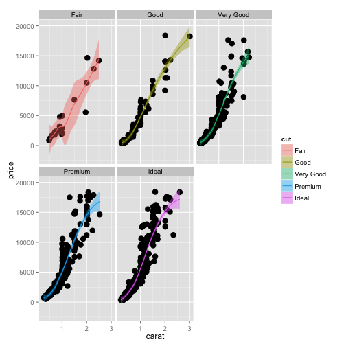
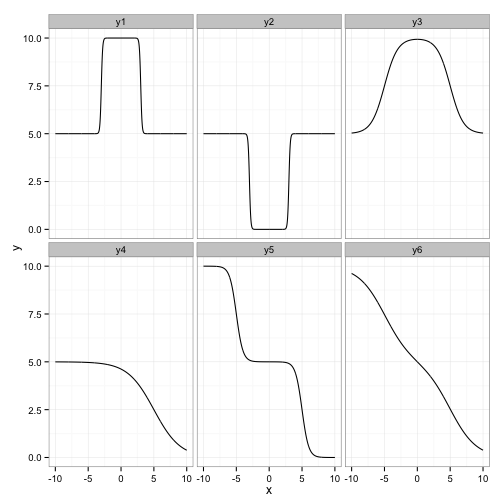

results_1
========================================================
author: 
date: 


Plots
========================================================

 

Nonlinear Modeling 
========================================================
A modified model:

$$ logit(y_i) = \alpha + \beta \cdot X_i + f(G_{ij}) $$

where

$$ X_i = [Gender_i, Age_i, CommaScore_i, MarshallScore_i] $$

and

$$ f(G_i) = \frac{1}{n_i} \sum_j{ \frac{c_1}{1 + e^{-c_2(G_{ij} - c_3)}} + \frac{c_4}{1 + e^{-c_5(G_{ij} - c_6)}}  } $$
$$ n_i = \text{ length of timeseries for patient }i $$

Double Logistic Function Examples
========================================================

 

Random Functions
========================================================

These are functions drawn from the priors in the model and show all possibilities:


Nonlinear Effects
========================================================


Sample Size Effects (Fully Simulated Data)
========================================================


Function Forms on Semi-Simulated Data
========================================================
By semi-simulated, I mean by taking the real data and hard coding coefficient / function values.


GLM Model Results
========================================================

<!--Results from a few ordinal GLMs -->


Exhaustive Model Results
========================================================

Results from exhaustive binary model search


Cutpoint Model Results
========================================================

Results from cutpoint modeling


Nonlinear Models
========================================================


```r
summary(cars)
```

```
     speed           dist       
 Min.   : 4.0   Min.   :  2.00  
 1st Qu.:12.0   1st Qu.: 26.00  
 Median :15.0   Median : 36.00  
 Mean   :15.4   Mean   : 42.98  
 3rd Qu.:19.0   3rd Qu.: 56.00  
 Max.   :25.0   Max.   :120.00  
```

Slide With Plot
========================================================

 
